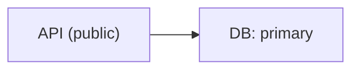
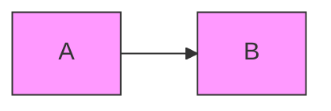

# Mermaid Best Practices

## Authoring Defaults

- 目的ごとに diagram type を選び、1 枚 1 目的を守る。
- node id は短く固定し、表示文言は label に置く。
- flowchart では `graph` より `flowchart` を優先して意図を明示する。
- 長文 label は短く要約し、詳細は周辺説明へ逃がす。

## Quoting And Escaping

- punctuation を含む flowchart label は quote する。
  - 例: `A["API (public)"] --> B["DB: primary"]`
- edge label に punctuation を入れるときも quote する。
  - 例: `A -->|"retry: 3 times"| B`
- `#` などで崩れる場合は entity code を使う。
  - 例: `#35;`
- flowchart / sequence diagram では `end` が breaker になりうる。label として使うなら quote する。
- `%%` comment の中に `{}` を書かない。directive と紛れて壊れやすい。

## Style And Layout

- 単発の `style` 連打より `classDef` / `class` を優先する。
- 同じ見た目を 3 回以上使うなら class 化する。
- `classDef` の style value で comma を使うときは `\,` で escape する。
  - 例: `stroke-dasharray: 5\, 5`
- flowchart が横に広がる依存図なら `LR`、段階進行なら `TD` を先に検討する。
- 線が交差しすぎるときは node を詰め込まず、subgraph 分割か図の分離を優先する。

## Review Checklist

- diagram declaration は 1 行目にあるか
- label に quote が必要な punctuation が残っていないか
- inline style の乱立で可読性を落としていないか
- node id が `a1`, `a2`, `a3` のような意味不明な連番だけになっていないか
- 1 枚の図に複数の責務を詰め込んでいないか
- render 検証を通したか

## Local Validation

### Render Validation

```bash
./skills/create-mermaid-diagram/scripts/check_mermaid.sh path/to/diagram.mmd
```

### Fail On Heuristic Warnings

```bash
./skills/create-mermaid-diagram/scripts/check_mermaid.sh --strict path/to/diagram.mmd
```

### Validate Mermaid Fences Inside Markdown

```bash
./skills/create-mermaid-diagram/scripts/check_mermaid.sh path/to/readme.md
```

## Common Repair Moves

### Flowchart labels with punctuation

Bad:

```mermaid
flowchart LR
  A[API (public)] --> B[DB: primary]
```

Good:



### Repeated inline styles

Bad:



Good:


