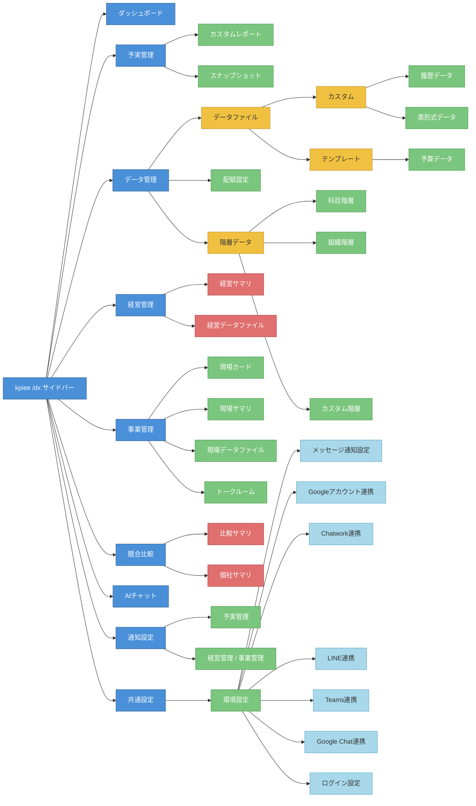

# kpiee /dx 画面構成マップ

2026-04-10 時点の本番環境 (app.kpiee.com) を playwright-cli で巡回して取得。
workspace: データX (ID: 4)。

## 構成図

凡例: 青=セクション / 緑=アクセス可能ページ / 黄=中間カテゴリ / 赤=forbidden / 水色=環境設定サブ項目

## ページ一覧

| セクション | ページ | URL パターン | 機能概要 |
|---|---|---|---|
| ダッシュボード | ダッシュボード | `/dx/workspaces/:id/dashboards` | パネルを追加してグラフ/KPI を自由配置するダッシュボード。複数作成可能 |
| 予実管理 | カスタムレポート | `/dx/workspaces/:id/reports` | レポートの新規作成・集計実行・フォルダ整理。列: レポート名/ステータス/形式/作成者/最終設定日時/最終集計日時 |
| | スナップショット | `/dx/workspaces/:id/snapshots` | レポートの時点コピーを保存・管理。元レポートとの紐付きあり |
| データ管理 | 履歴データ | `/dx/workspaces/:id/record_data_files` | 時系列の実績データファイルを取込/新規作成/加工/結合。処理ステータスでフィルタ可能 |
| | 表形式データ | `/dx/workspaces/:id/table_data_files` | 表形式（非時系列）のデータファイルを取込/新規作成。取込ステータスでフィルタ可能 |
| | 予算データ | `/dx/workspaces/:id/budget_data_files` | 予算テンプレートに沿ったデータファイルを取込/新規作成 |
| | 配賦設定 | `/dx/workspaces/:id/allocations` | コスト配賦ルールの定義・管理。ステータス（有効/無効）、メモ付き |
| | 科目階層 | `/dx/workspaces/:id/master_v2/tables/accounting` | 勘定科目の階層データを新規作成/管理 |
| | 組織階層 | `/dx/workspaces/:id/master_v2/tables/organization` | 部門・組織の階層データを新規作成/管理 |
| | カスタム階層 | `/dx/workspaces/:id/master_v2/types/custom` | 「カスタム階層種別」と「カスタム階層データ」の二層構造。種別ごとに複数の階層データを持てる |
| 経営管理 | 経営サマリ | forbidden | 権限不足で未確認 |
| | 経営データファイル | forbidden | 権限不足で未確認 |
| 事業管理 | 現場カード | `/workspaces/:id/tips` | KPI ごとに目標対比・目標・実績・目標差分・前Q実績差分をカード形式で表示。フォルダで整理可能 |
| | 現場サマリ | `/workspaces/:id/tips/kpi_data_summary` | KPI をダッシュボード的なパネル配置で俯瞰。日付で時点切替、共有/非共有の切替あり |
| | 現場データファイル | `/workspaces/:id/data_files?dataType=DataFile` | KPI の元データファイルを取込・管理 |
| | トークルーム | `/workspaces/:id/tips/:tip_id/messages` | カード単位のコメントスレッド。日付区切りのメッセージ一覧、コメント検索可能 |
| 競合比較 | 比較サマリ | forbidden | 権限不足で未確認 |
| | 個社サマリ | forbidden | 権限不足で未確認 |
| AIチャット | AIチャット | `/workspaces/:id/ai_chat` | kpieebot との対話形式で経営指標・KPI について質問・分析 |
| 通知設定 | 予実管理 | `/dx/workspaces/:id/notification_settings` | レポート通知の ON/OFF・通知先・通知タイミングを設定 |
| | 経営管理 / 事業管理 | `/workspaces/:id/notification_groups` | KPI 通知グループを名前付きで作成・管理 |
| 共通設定 | 環境設定 | `/workspaces/:id/environment_settings/notification_management` | メッセージ通知設定 / Googleアカウント連携 / Chatwork連携 / LINE連携 / Teams連携 / Google Chat連携 / ログイン設定 の 7 サブ設定 |

## 備考

- 事業管理・AIチャット・通知設定（経営管理/事業管理）・環境設定は URL に `/dx` prefix がなく、旧ルーティングの可能性あり
- 経営管理・競合比較は「データX」ワークスペースでは forbidden。別ワークスペースまたは権限設定で開放される可能性あり
- `:id` は workspace ID（データX = 4）、`:tip_id` はカード ID
